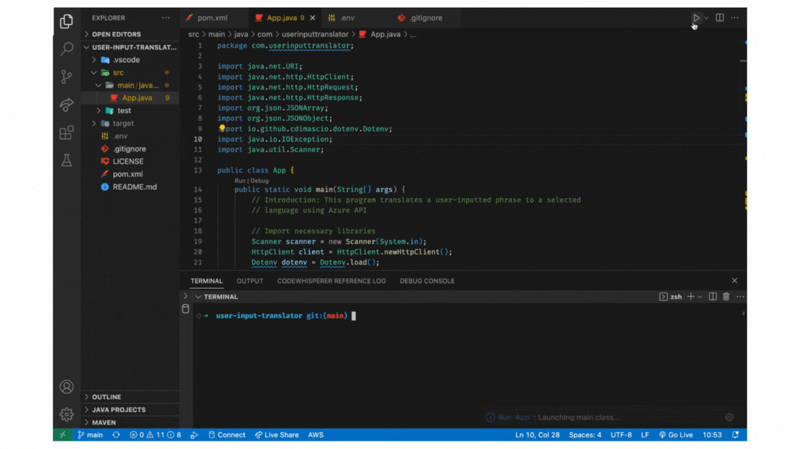

# User Input Translator

User Input Translator is an interactive console application developed in Java that leverages **Azure Cognitive Services**. It utilizes the Azure Translator API to translate text input by the user into various languages. This application demonstrates the integration of cloud-based AI services in a Java-based environment, offering a practical example of how such technologies can be used to build functional and interactive applications.

## Preview

Here is a quick preview of the User Input Translator in action:



For a more comprehensive view, check out the related video on YouTube:
[Watch the Video](https://youtu.be/sE_CXF_LvSE)


## Overview

This console application was developed as part of a TechBridge assignment while I was preparing for the Microsoft Azure AZ-900 certification. I utilized the Azure AI Translator service to add a real-world application element to the concepts I was learning. The goal was to create a small Java program that meets the following requirements as per the assignment prompt:

> "Get Creative! Create a small program that takes user input using a scanner and any data type. Display the value input. Then, perform some type of manipulation on that value and display that result. Do your best to incorporate as many elements from the lesson. (Data types, Operators, Input, Output, and Comments.)"

To fulfill these requirements, this console application accepts text input from the user, along with the source and target language codes, and leverages the Azure Translator Text API to translate the text. The translated text is then displayed to the user.

## Objective Achievements

- **Data Types**: Utilized strings to handle text input and output and primitive data types for temporary variable storage.
- **Operators**: Implemented string manipulation operations such as concatenation and methods to process translation responses.
- **Input**: Incorporated the Scanner class to facilitate user input.
- **Output**: Utilized System.out.println to display results, including translated text, to the user.
- **Comments**: Integrated comments throughout the code to clarify the function and purpose of various sections and operations.

## Prerequisites
- Java Development Kit (JDK) 11 or later must be installed on your machine.
- Maven must be installed if you wish to build and run the project using Maven.
- An Azure subscription and a Translator resource created on the Azure portal. You will need the subscription key and the region for your resource.

## Setup
To set up and run the User Input Translator, follow these steps:

1. Clone the repository: `git clone https://github.com/gaebar/user-input-translator.git`
2. Navigate to the project directory: `cd user-input-translator`
3. Open the project in your preferred IDE or text editor.
4. Set up the Azure Translator Text API according to the instructions in the 'Azure Setup' section. You can find detailed instructions [here](https://learn.microsoft.com/en-us/azure/ai-services/translator/).
5. Build the project: Use Maven to compile the project and download necessary dependencies `mvn clean install`.
6. Run the application: Execute the main method in the App class to start the program `mvn exec:java -Dexec.mainClass="com.userinputtranslator.App"`.
- This command compiles and runs the application, which will then prompt you in the terminal to enter the text you wish to translate and the language code to translate to.
7. Follow the prompts in the console to input the text and select the language you want to translate to. The translated result will be displayed in the console.

## Azure Setup

Before executing the program, ensure to set up the Azure Translator Text API:

1. Create an Azure account if not already available.
2. Establish a Translator Text resource in the Azure portal. Follow the guidelines provided in the [Azure AI Translator documentation](https://learn.microsoft.com/en-us/azure/ai-services/translator/).
3. Record the API key and endpoint URL.
4. Create an .env file in the root directory of the project and add your Azure Translator Text API subscription key and region as follows:
   
   ```
   AZURE_API_KEY=your_azure_api_key_here
   AZURE_REGION=your_azure_region_here
   ```

Replace `your_azure_api_key_here` and `your_azure_region_here` with your actual Azure API key and region.

## Usage

Run the program and adhere to the prompts to input text and designate the source and target languages for translation. Refer to the official documentation for a list of valid language codes. The program will then present the translated text.


## Contributing

Contributions are welcomed! Feel free to fork the repository and submit pull requests. I appreciate your contributions to further improve this project, including enhancements and bug fixes.

## License

This project is open-source and available under the [MIT License](https://opensource.org/licenses/MIT).
